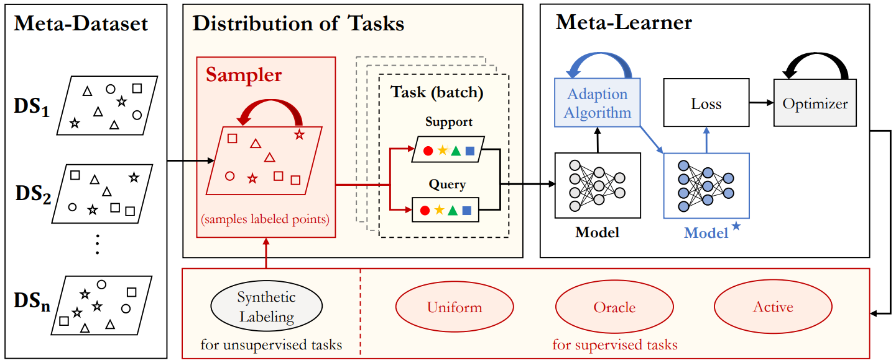

<p align="center"></p>

<h3 align="center">A Modular Toolbox for Accelerating Meta-Learning Research :rocket:</h3>

----

**WARNING:** Repository is under construction. Feel free to star and subscribe for updates, but the code will be unstable and might be changing under the hood until the first beta. 

----

[](https://pypi.org/project/meta-blocks/)
[](https://pypi.org/project/meta-blocks/)
[](https://travis-ci.org/alshedivat/meta-blocks)
[](https://meta-blocks.readthedocs.io/en/latest/?badge=latest)
[](https://coveralls.io/github/alshedivat/meta-blocks?branch=master)
[](https://github.com/psf/black)

**Meta-Blocks** is a modular toolbox for research, experimentation, and reproducible benchmarking of learning-to-learn algorithms.
The toolbox provides flexible APIs for working with `MetaDatasets`, `TaskDistributions`, and `MetaLearners` (see the figure below).
The APIs make it easy to implement a variety of meta-learning algorithms, run them on well-established and emerging benchmarks, and add your own meta-learning problems to the suite and benchmark algorithms on them. 

 

**Meta-Blocks** package comes with:

* **Flexible APIs, detailed documentation, and multiple examples.**
* **Popular models and algorithms** such as MAML [1], Reptile [2], Protonets [3].
* **Supervised and unsupervised meta-learning** setups compatible with all algorithms.
* **Customizable modules and utility functions** for quick prototyping on new meta-learning algorithms.

**Links and Resources**:

* [View the latest code on Github]()
* [Execute Interactive Jupyter Notebooks]()
* [Documentation and APIs]()

---

### Installation


It is recommended to use **pip** for installation. Please make sure
**the latest version** is installed, as **meta-blocks** is updated frequently:


```shell
$ pip install meta-blocks            # normal install
$ pip install --upgrade meta-blocks  # or update if needed
$ pip install --pre meta-blocks      # or include pre-release version for new features
```

Alternatively, you could clone and run setup.py file:

```
$ git clone https://github.com/alshedivat/meta-blocks.git
$ cd meta-blocks
$ pip install .
```

**Required Dependencies** :

* albumentations
* hydra-core
* numpy
* Pillow
* scipy
* scikit-learn
* tensorflow>=2.1

---

### Examples

TODO:
We should provide a minimal example so people could run immediately.
Ideally, the running time should be within a few mins.

----

### Development

For development and contributions, please install pre-commit hooks to ensure proper code style and formatting:

```shell
$ pip install pre-commit      # install pre-commit
$ pre-commit install          # install git hooks
$ pre-commit run --all-files  # run pre-commit on all the files
```

#### Status

**Meta-Blocks** is currently **under development** as of Apr, 2020.

**Watch & Star** to get the latest update! Also feel free to contact for suggestions and ideas.

----

### Citing Meta-Blocks

TODO: add citation information as soon as available.

----


### Reference

[1] Finn, C., Abbeel, P. and Levine, S. Model-agnostic meta-learning for fast adaptation of deep networks. ICML 2017.

[2] Nichol, A., Achiam, J. and Schulman, J. On first-order meta-learning algorithms. arXiv preprint arXiv:1803.02999.

[3] Snell, J., Swersky, K. and Zemel, R. Prototypical networks for few-shot learning. NeurIPS 2017.
