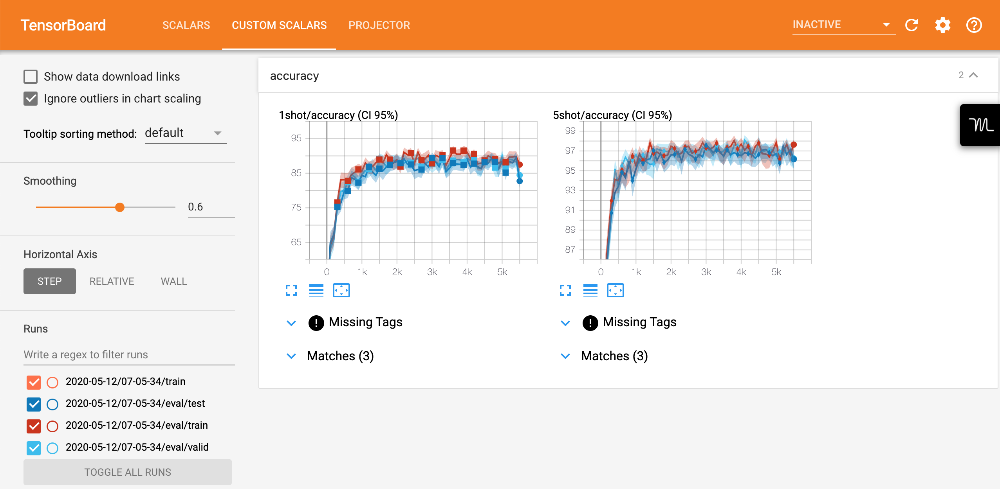

# MetaBlocks Benchmarking Suite

**MetaBlocks** comes with a highly configurable suite of benchmarks enabling the ultimate reproducibility.
Each variation, setting, and method are precisely configured using [hydra](https://hydra.cc) and the best configurations are committed and stored in the repository.

## Getting started with benchmarks

To run a benchmark, simply clone the repo, change your working directory to the directory of the benchmark of interest, (fetch data if necessary,) and execute a run script.
For example:
```shell script
$ git clone https://github.com/alshedivat/meta-blocks.git
$ cd meta-blocks/benchmarks/omniglot
$ ./fetch_data                    # fetches data for the benchmark
$ ./run_classic_supervised.sh     # runs an experiment (train and eval routines)
```
The script will run training and eval in two separate processes (i.e., training is not blocked by the eval).
All the logging and checkpoint information will be stored in a directory with the date and time of the run (`outputs/<YYYY-MM-DD>/<HH-MM-SS>`).
The stdout log of the above example will look similar to the following:
```
...
[05/12/20 07:13:45 - 00:08:12][meta_blocks.experiment.train][INFO][TRAIN] - step: 210
                                                                            requested labels: 75000
                                                                            CSTD_train loss: 0.811411
[05/12/20 07:13:49 - 00:08:16][meta_blocks.experiment.eval][INFO][EVAL] - --------------------------------------------------
                                                                          evaluated: ckpt-200
                                                                          train/1shot/accuracy (CI 95%):    66.88 ±  2.92
                                                                          train/5shot/accuracy (CI 95%):    87.88 ±  1.90
                                                                          valid/1shot/accuracy (CI 95%):    65.92 ±  2.78
                                                                          valid/5shot/accuracy (CI 95%):    86.68 ±  1.84
                                                                          test/1shot/accuracy (CI 95%):     67.28 ±  2.70
                                                                          test/5shot/accuracy (CI 95%):     87.12 ±  1.46
                                                                          --------------------------------------------------
...
```
Note that since training and eval are decoupled, we are able to train methods in one regime (e.g., on a distribution of 5-way, 1-shot training tasks) while concurrently evaluating in multiple other regimes (e.g., 1-/5-shot tasks from train, valid, and test distributions).

### Visualizing benchmark runs

After (or during) the run, we can visualize it using TensorBoard as follows:
```shell script
$ tensorboard --logdir "outputs/<YYYY-MM-DD>/<HH-MM-SS>"
```
MetaBlocks provides neat `custom_scalar` charts for visualizing runs:


### (Re-)configuring benchmarks

Each benchmark comes with a hierarchical YAML-based configuration stored in `<benchmark>/conf/` directory, where `<benchmark>/conf/config.yaml` specifies the configuration template.
 We use [hydra](https://hydra.cc) to load and process these configs.
 
 Hydra allows to specify fields omitted in the configs (denoted `???`) and override arbitrary fields though command line arguments.
 For instance, consider the following script:
 ```shell script
python -u run.py \
    benchmark=classic_supervised/5way/1shot \
    backbone=classic_supervised/5way/1shot/simple_cnn \
    method=classic_supervised/5way/1shot/maml \
    meta_blocks.data.source.data_dir="$(realpath .)/data/omniglot" \
    meta_blocks/compute=1gpu
```
Here, `benchmark`, `backbone`, and `method` specify relative paths to YAML config files that will be loaded and combined by hydra; `meta_blocks.data.source.data_dir` overrides the path to the data, and `meta_blocks/compute` specifies the 1-GPU experiment setup pre-defined in the meta-blocks (see all the pre-defined cofigurations in `meta_blocks/experiment/conf`).
To change any configuration, you can either override it in your run script or directly edit the corresponding YAML file.

**Note:** current configurations are not heavily tuned, so if you can find a better configuration for any of the existing methods/setups, please consider submitting a quick PR! :pray:

## Benchmarking on your own datasets

To benchmark existing methods on your own dataset (assuming you correctly implemented it and follows meta-blocks API), simply copy one of the existing benchmark folders to `benchmarks/<your-dataset>/` and make the following changes:
* In `benchmarks/<your-dataset>/conf/config.yaml`, change `meta_blocks/data: <your-dataset>`.
* In `benchmarks/<your-dataset>/conf/benchmark/*` adjust any of the configs or creat new setups.
* Add `fetch_data.sh` and `run.sh` script for fetching the data and running experiments.

**Note:** We are actively looking to expand the benchmarking suite.
If you have an cool meta-dataset, please consider submitting a PR!

## Benchmarking your own algorithms

To add your own method to one of the existing benchmarks (assuming your method follows meta-blocks API), simply add YAML config files to `benchmark/<benchmark>/conf/method/**/<your-method>.yaml`.
Each subdirectory within `benchmark/<benchmark>/conf/method/` corresponds to a variation of the benchmark (e.g., 5-/20-way and 1-/5-shot) and requires a separate configuration file for your method (since optimal parameters for your method might be different for different benchmark variations).

Once configurations for your method are added, you should be able to run the benchmark using one of the provided run scripts.
